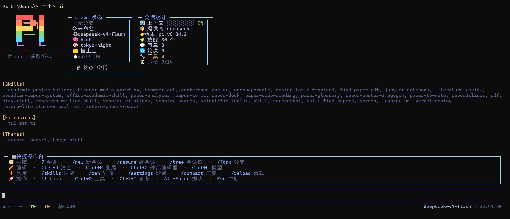

# π TUI Zen

多彩终端界面增强扩展，为 [pi](https://github.com/earendil-works/pi) 添加彩虹品牌 header、状态仪表盘、快捷操作台与技能分类浏览。

## 功能特性

- **🎨 彩虹 π 艺术字 header** — box-drawing 大 π banner，每行彩虹渐变，附彩虹分隔线
- **📊 双信息面板**（宽屏并排，窄屏自动降级）
  - `π zen 状态`：git 分支、会话名、模型、思考级别、当前主题、工作目录、实时时钟
  - `会话统计`：上下文使用率进度条（`▓▓▓░░░░░░░ 23%`）、提供商、pi 版本、技能数、消息/轮次/工具、运行时长、工作状态
- **⌨ 快捷操作台** — 编辑器上方分区展示常用快捷键与指令（导航 / 编辑 / 常用 / 操作）
- **🧩 技能分类浏览** — `/skills` 按分类（论文检索、阅读笔记、学术写作、海报演示、音视频媒体、Web 开发）浏览已安装技能
- **🌈 彩虹动画** — 流式响应时的 7 色旋转 spinner、终端标题栏动画
- **⏱ 动态信息** — footer 实时 token 统计、成本、时钟、turn 状态徽章（`● 思考中…` / `✓ 本轮完成`）

## 界面预览



## 安装

### 作为 pi 包（推荐）

```bash
pi install git:github.com/zzcuagain/pi-tui-zen
```

或从 npm：

```bash
pi install npm:pi-tui-zen
```

### 手动（本地使用）

把 `extensions/tui-zen.ts` 复制到 `~/.pi/agent/extensions/`，然后 `/reload`。

## 使用

| 命令 | 说明 |
|------|------|
| `/zen` | 显示状态（已启用 / 已停用） |
| `/zen on` | 启用全部界面增强 |
| `/zen off` | 恢复 pi 默认界面 |
| `/skills` | 按分类浏览已安装的技能 |

## 可选的配套主题

本扩展在以下主题下效果最佳（放入 `~/.pi/agent/themes/` 后在 `/settings` 中切换）：

| 主题 | 风格 |
|------|------|
| `tokyo-night` | 蓝紫霓虹 |
| `aurora` | 青绿极光 |
| `sunset` | 橙粉日落 |

## 开发

```bash
git clone https://github.com/zzcuagain/pi-tui-zen
cd pi-tui-zen
# 本地试运行
pi -e ./extensions/tui-zen.ts
```

## 许可

MIT
